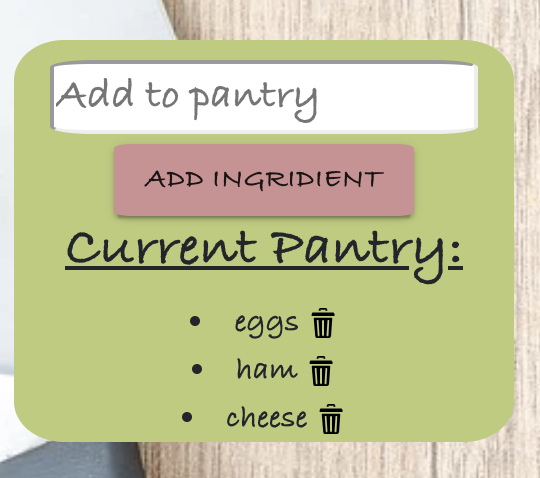
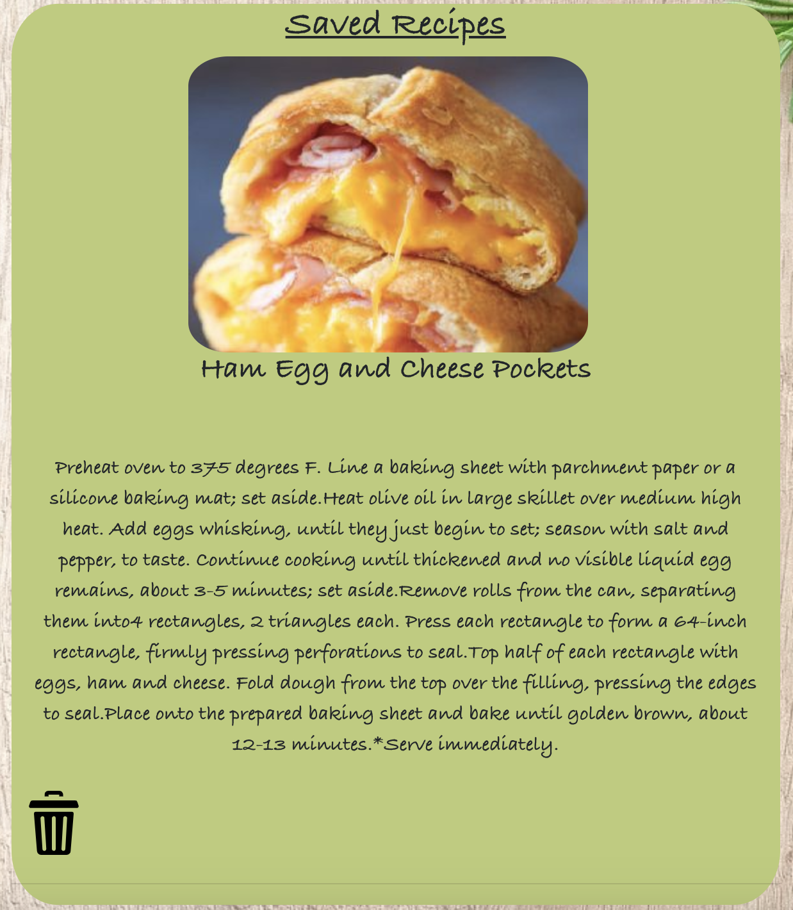

# Pantry

Link To Deployed Heroku Site: 

## Summary
Pantry is a MERN stack web aplication, that allows its users create a profile and Login/Logout using firebase. Once logged in users are able to add ingredients to their "pantry". Using Spoonaculars's API recipes are then shown to the user based on the ingredients in their "pantry". Recipes are able to be saved, and displayed under the "Saved Recipes" section.

 Login Page    
 Home Page   
 User's Pantry   
 User's Saved Recipe   

## Technologies Used

- HTML
- CSS
- Javascript
- React
- MongoDB Atlas
- APIs –  Spoonacular
- Firebase
- Heroku
 
 
 

## Authors
- Aldo Huayhua- https://github.com/aldohuayhua
- Khalid Massoud- https://github.com/khalidmassoud
- Zee (Ziad) Eldesouky- https://github.com/ziaddessoki
- Eric Max Valdivia - https://github.com/Ericv0801

