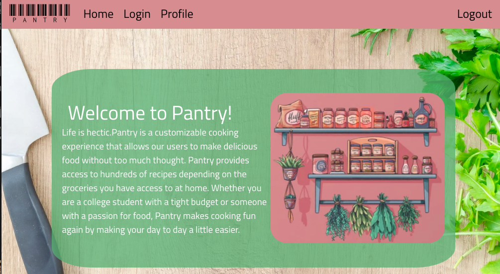
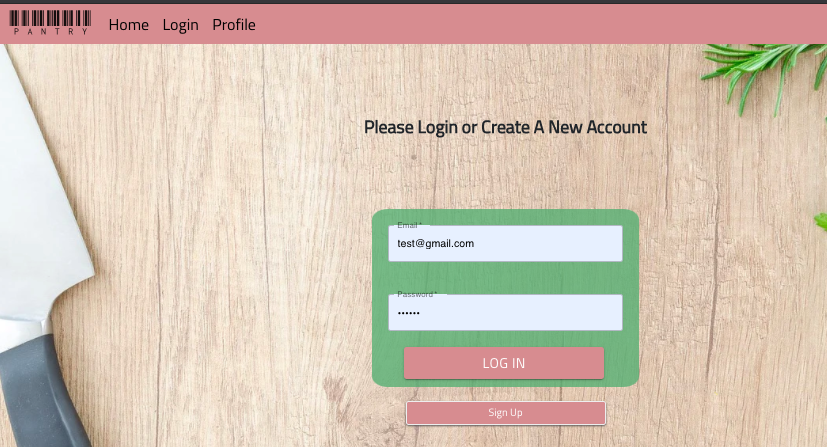
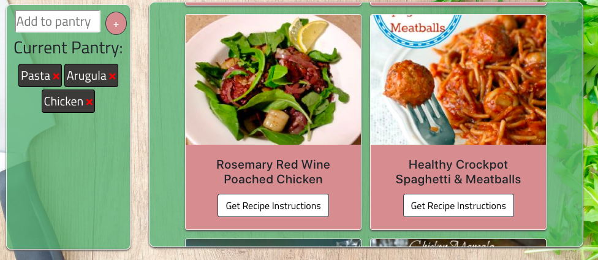
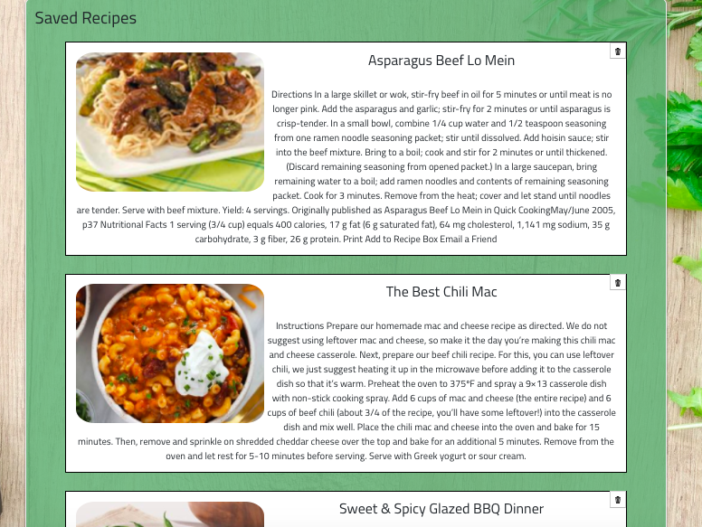

# Pantry

Link To Deployed Heroku Site: 

Pantry is a MERN stack web aplication, that allows its users create a profile and Login/Logout using firebase. Once logged in users are able to add ingredients to their "pantry". Using Spoonaculars's API recipes are then shown to the user based on the ingredients in their "pantry". Recipes are able to be saved, and displayed under the "Saved Recipes" section.

## Instructions
- Sign-Up
- Add whatever ingredients you have to the pantry list
- Click "Search" to look up recipes with your ingredients
- you can view the instructions
- You can also save these instructions to your account to view later

 <strong>Home Page </strong>  
 <strong>Login Page</strong>    

 <strong>User's Pantry </strong>   
 <strong>User's Saved Recipe </strong>   

## Technologies Used

- HTML
- CSS
- Javascript
- React
- MongoDB Atlas
- APIs –  Spoonacular
- Firebase
- Heroku
 

## Future Development

- Barcode scanning
- Mobile app
 
 

## Authors
- Aldo Huayhua- https://github.com/aldohuayhua
- Khalid Massoud- https://github.com/khalidmassoud
- Zee (Ziad) Eldesouky- https://github.com/ziaddessoki
- Eric Max Valdivia - https://github.com/Ericv0801

